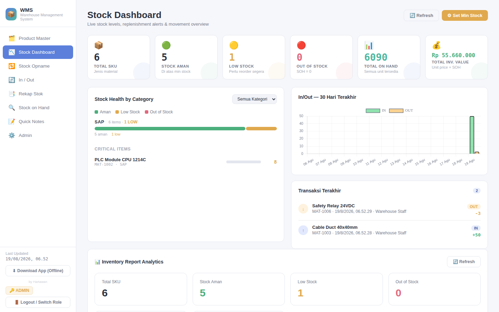
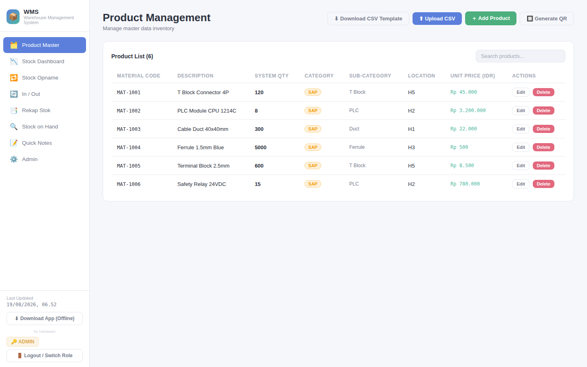
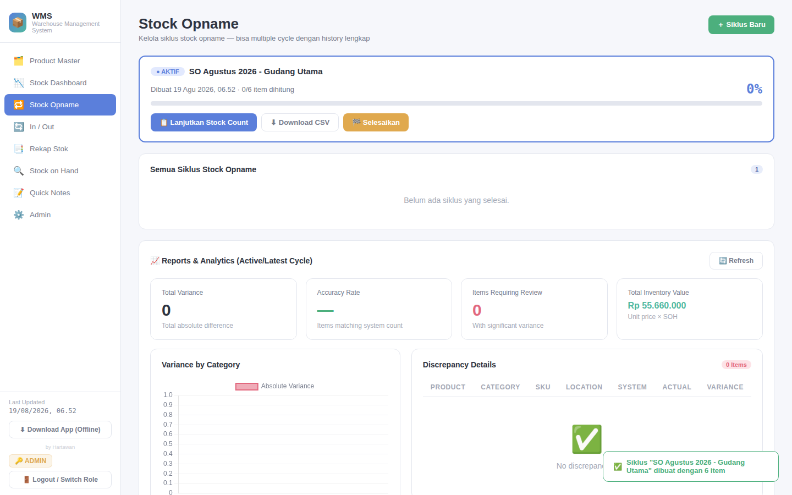
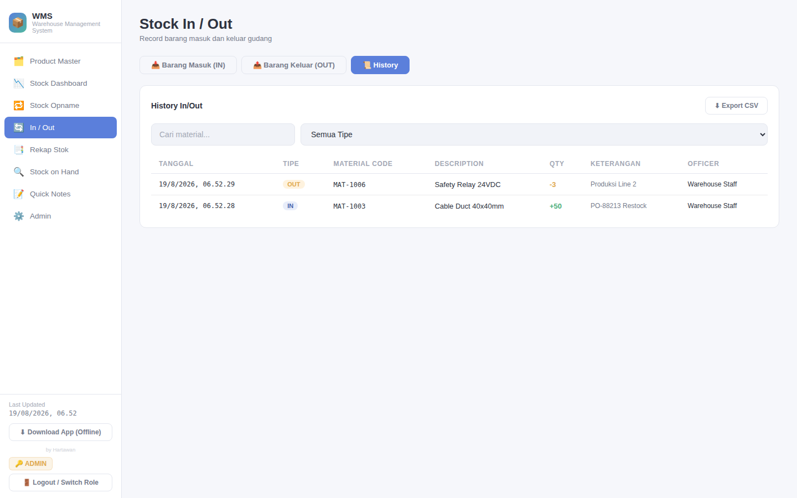
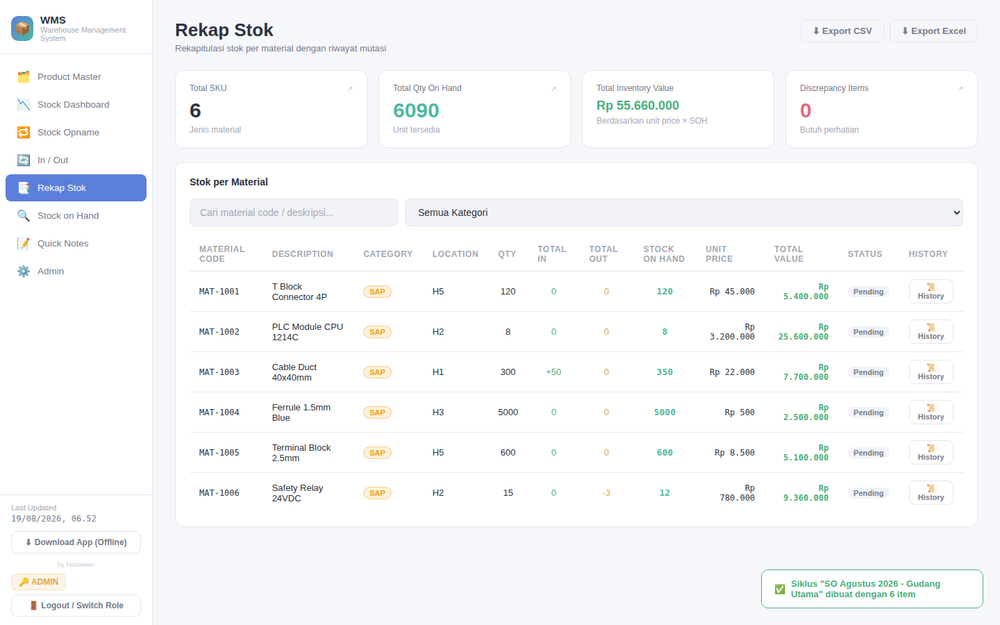
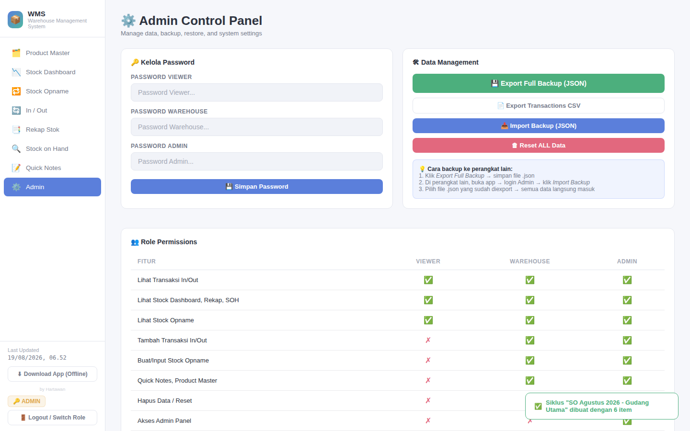

# 📦 Warehouse Management System (WMS)

A full-featured, single-file Warehouse Management System built independently as a self-directed project — no backend, no build tools, no dependencies to install. Open the HTML file and the entire system runs in the browser, with all data persisted locally.

Built to reflect real warehouse operations: stock opname (cycle counting), inbound/outbound tracking, replenishment monitoring, and reporting — the same processes used in enterprise WMS/ERP platforms like SAP WM, Oracle, and Odoo, reimplemented from scratch to demonstrate both domain knowledge and front-end engineering ability.

**🔗 Live/Download:** open `WMS.html` directly in any modern browser — works fully offline after first load.

---

## Why I Built This

With 7+ years in warehouse and supply chain operations, I saw firsthand how much friction comes from spreadsheet-based stock tracking — manual reconciliation, no audit trail, no real-time visibility into reorder points. This project is my attempt to solve that: a lightweight, dependency-free WMS that a small warehouse team could realistically adopt without IT overhead, while also serving as a demonstration of my transition from warehouse operations into IT Business Analyst / application development work.

---
## Screenshots

<table>
  <tr>
    <td width="33%">
<b>Stock Dashboard</b>
</td>
    <td width="33%">
<b>Product Master</b>
</td>
    <td width="33%">
<b>Stock Opname</b>
</td>
  </tr>
  <tr>
    <td width="33%">
<b>Stock In / Out</b>
</td>
    <td width="33%">
<b>Rekap Stok</b>
</td>
    <td width="33%">
<b>Admin Panel</b>
</td>
  </tr>
</table>
## Core Features

### 🗂️ Product Master
- Full CRUD for SKUs: material code, description, quantity, category/subcategory, location, unit price
- CSV bulk import/export with a robust numeric parser (handles both `1,000.50` and `1.000,50` formats)
- Category tree management (parent → sub-category)
- QR code generation per SKU for physical labeling

### 🔁 Stock Opname (Cycle Counting)
- Create counting cycles from CSV upload, track progress live
- Per-item physical count entry with variance calculation (system qty vs. actual)
- Minimizable "in-progress" counting session — continue other work without losing your place
- Add unlisted/extra items found during a count
- Re-upload master data mid-cycle without losing count progress
- Embedded reports: total variance, accuracy rate, items requiring review, inventory value

### 🔄 Stock In / Out
- Scan or type to look up a product, confirm quantity and note, save transaction
- Automatic stock-on-hand calculation from system qty + all IN/OUT history
- Full editable/deletable transaction history with search and type filters

### 📉 Stock Dashboard
- Live KPIs: total SKUs, OK/Low/Out-of-stock counts, total qty, total inventory value
- Stock health visualization by category with drill-down
- Replenishment warning table with search, status, and category filters
- Movement chart (recent IN/OUT activity) and clickable stat cards for detail views

### 🕰️ Stock Aging Report *(new)*
- Every SKU classified into Fresh (≤30 days), Watch (31–90 days), Aging (91–180 days), or Dead Stock (>180 days / never moved), based on the most recent IN, OUT, or count event
- Sortable, filterable table (by aging bucket, category, or search) — built to surface slow-moving inventory the way a real cycle-count review would

### ⚠️ Low Stock / Reorder Point Alerts *(new)*
- Per-SKU minimum stock (reorder point) configuration
- Live sidebar badge showing how many items are currently low or out of stock
- One-time login alert summarizing items needing attention

### 🔲 Barcode/QR Camera Scanning *(new)*
- Scan physical barcodes or QR codes directly from a device camera on the Stock Count, Stock In/Out, and Stock-on-Hand lookup screens
- Uses the native `BarcodeDetector` API where available, with a `jsQR`-based canvas fallback for broader browser support
- Auto-fills and submits the scan result — no manual typing needed on the warehouse floor

### 🧾 Activity Log *(new)*
- System-wide audit trail: logins, product add/delete, stock in/out, cycle creation/completion, CSV imports, reorder-point changes
- Each entry records action, detail, role, and timestamp
- Searchable and filterable by action type

### 🌙 Dark Mode *(new)*
- Full dark theme toggle, persisted across sessions
- Applied consistently across all pages, charts, and tables

### 📑 Rekap Stok & Stock-on-Hand Lookup
- Aggregated stock recap by SKU/category with real-time inventory value
- Quick single-item SOH lookup by code or scan

### 📝 Quick Notes
- Lightweight tagged notes (Urgent / Info / Done / General) for warehouse team communication

### 🔐 Role-Based Access Control
- Three roles — **Viewer**, **Warehouse**, **Admin** — each with different write/delete permissions enforced at the UI level
- Password-protected login with role-specific navigation and controls

---

## Tech Stack

| Layer | Choice | Why |
|---|---|---|
| Structure | Single HTML file | Zero install, zero build step — runs anywhere, including offline |
| Charts | Chart.js | Dashboard visualizations, variance charts, movement trends |
| CSV parsing | PapaParse | Robust import/export for master data and cycle counts |
| QR codes | qrcode.js | Label generation for physical SKU tagging |
| Barcode scanning | Native `BarcodeDetector` API + `jsQR` fallback | Camera-based scanning without a native app |
| Persistence | `localStorage` | Fully offline-capable; no backend required |
| Styling | Hand-written CSS with CSS custom properties | Enables full dark-mode theming with minimal duplication |

---

## Architecture Notes

- **State management**: a single in-memory state object (`products`, `scanResults`, `ioHistory`, `soCycles`, `quickNotes`, `categoryTree`, `activityLog`) serialized to `localStorage` on every mutation
- **Stock-on-hand** is always derived, never stored directly — computed as `base qty (from last count or master) + IN history − OUT history`, which keeps the system consistent even after edits to historical transactions
- **Role gating** is enforced both by hiding UI elements and disabling inputs, applied dynamically after login rather than hard-coded into each page template
- Designed to be portable: an "Download App (Offline)" button lets any user save a fully working copy of their current data as a standalone HTML file

---

## What I'd Build Next

- Backend sync (REST API) for multi-device/multi-warehouse use
- Batch/lot tracking with FIFO/FEFO expiry logic
- Role-based approval workflows for stock adjustments
- Export activity log and aging report to PDF/CSV for management reporting

---

## About Me

Warehouse & Supply Chain professional (7+ years) transitioning into IT Business Analyst work. This project sits at that intersection — built from direct operational experience with stock opname, inventory accuracy, and replenishment processes, implemented as a working application to demonstrate both domain expertise and hands-on development capability.

**Hartawan Sampoerna Wijaya**
📍 Depok, West Java, Indonesia
🎓 S1 Teknik Industri — Institut Sains dan Teknologi Nasional (2016)
